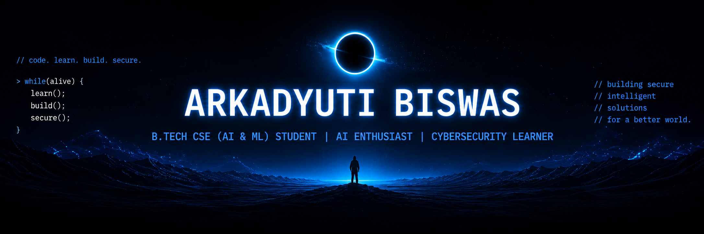

<div align="center">



# 👋 Hi, I'm Arkadyuti Biswas


<br>

<a href="mailto:arkadyutibiswas2106@gmail.com">

</a>

<a href="https://github.com/arkadyutibiswas">

</a>

<a href="https://linkedin.com/in/arkadyuti-biswas/">

</a>

</div>

---

<table>
<tr>

<td width="40%" align="center">


</td>

<td width="60%">

```text
arkadyuti@github
──────────────────────────────────────────

Education      : B.Tech CSE (AI & ML)

University     : Institute of Engineering &
                 Management

Semester       : 2nd

YGPA           : 8.67

Email          : arkadyutibiswas2106@gmail.com

Languages      : C
                 Python
                 JavaScript

Web            : HTML
                 CSS

Interests      : Artificial Intelligence
                 Machine Learning
                 Cybersecurity
                 Open Source

Current Focus  : AI Projects
                 Data Structures & Algorithms
                 Problem Solving

Featured Work  : Cipher AI Assistant
                 AURA Sign-to-Speech
                 Maze Solver (A*)

Status         : Building projects.
                 Learning every day.
```

</td>

</tr>
</table>

---

# 💻 Tech Stack

<p align="center">


</p>

---

# 📊 GitHub Analytics

<p align="center">


</p>

<p align="center">


</p>

---

# 🚀 Featured Projects

| Project | Description |
|---------|-------------|
| 🤖 **Cipher AI Assistant** | Intelligent desktop assistant capable of launching applications, answering questions, providing weather updates, telling jokes, reporting the current time, and assisting with everyday tasks. |
| 🤟 **AURA Sign-to-Speech** | AI-powered application that converts sign language gestures into speech for improved accessibility. |
| 🧠 **Expert System** | Rule-based expert system using forward chaining to provide intelligent recommendations across multiple knowledge domains. |
| 🧩 **Maze Solver (A\*)** | Interactive A* pathfinding visualizer featuring maze generation and algorithm visualization. |
| 🔐 **CyberSecurity Toolkit** | Collection of cybersecurity tools developed while exploring ethical hacking and network security concepts. |
| 💬 **NexBot Chatbot** | Rule-based chatbot with contextual responses and a structured knowledge base for interactive conversations. |

---

# 🌱 Currently Learning

- 🤖 Artificial Intelligence & Machine Learning
- 🧮 Data Structures & Algorithms
- 🔐 Cybersecurity Fundamentals
- 🌐 Modern Web Development
- 🌍 Open Source Collaboration

---

# 🎮 Beyond Coding

```text
🎌 Fantasy Anime
♟️ Strategy & Problem Solving
🎵 Music
💡 Exploring New Technologies
```

---

<p align="center">


</p>

---

<div align="center">

> **"Turning ideas into code, one commit at a time."**

⭐ Thanks for visiting my profile.

</div>
